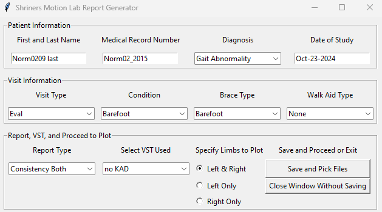

# Biomech_ReportGenerator
A user interface to select biomechanics data files and generate various types of clinical reports. Includes plotting data for kinematics, kinetics, electromygraphy, and spatiotemporal parameters.

Includes a function to filter and amplify EMG data for standardized EMG data reporting.

In the first screen, patient information is loaded from a file contained within the patients' folder.

# Main Report Screen

# File and Session Selection Screen

# Sample Kinetics Pages

