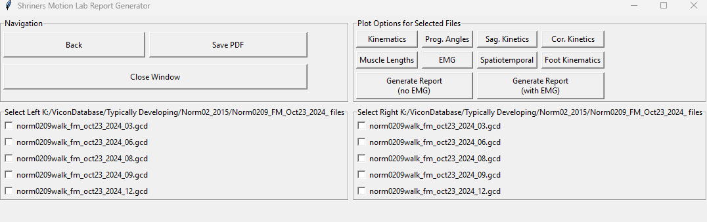
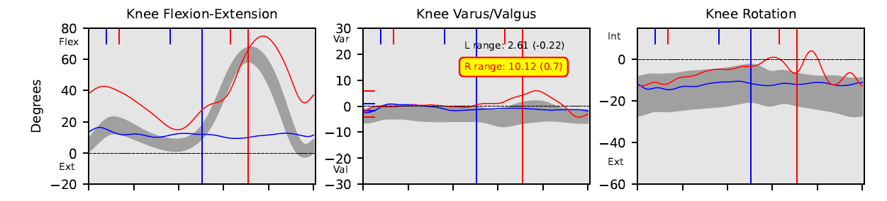
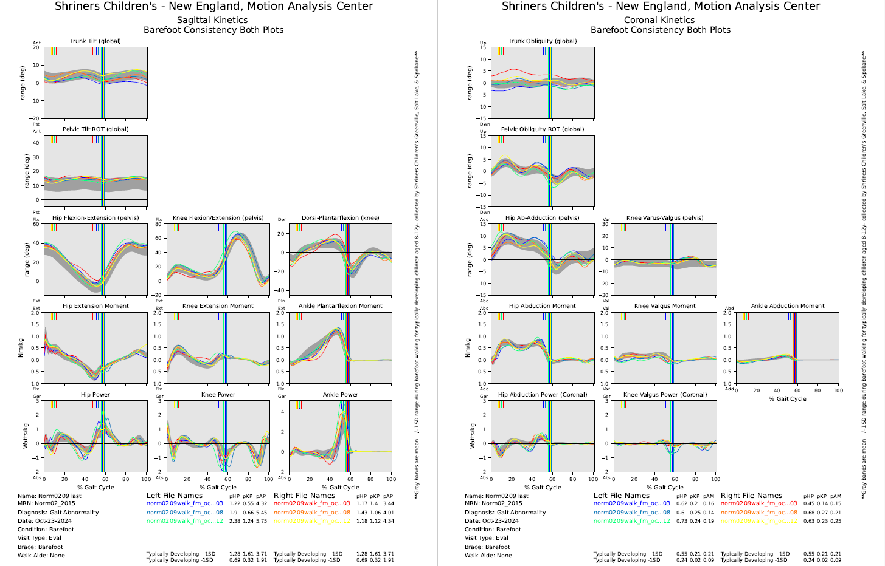

# Biomech_ReportGenerator
A user interface to select biomechanics data files and generate various types of clinical reports. Includes plotting data for kinematics, kinetics, electromygraphy, and spatiotemporal parameters.

Includes a function to filter and amplify EMG data for standardized EMG data reporting.

In the first screen, patient information is loaded from a file contained within the patients' folder.

# Main Report Screen

Here, drop down menu's are available to select various conditions, report types, and biomechanical models that were used during collection. Each item is added to the report.

# File and Session Selection Screen

Multiple trials can be selected at one time including trials across sessions. Trials are color coded on a spectrum of red-yellow for right limbs, and blue-green for left limbs.

# Sample Knee Varus-Flexion Cross-talk QA Check

All patient marker placement is confirmed in a single test walking trial to confirm accurate marker placement. 

Knee Varus-Flexion cross-talk is checked automatically when a single lower body kinematics page is produced. Our system standard is that the range of knee varus/valgus should be less than 10 degrees between peak knee flexion and minimum knee flexion during the swing phase of gait. If the range of knee varus valgus motion is greater than 10 degrees, this is an indication that marker placement is incorrect and knee flexion to varus/valgus motion is likely, necessitating replacement of the medial and/or lateral markers and a new static trial should be collected.

The test also shows, in parentheses, the r-squared value from a Pearson correlation between the full gait cycle knee flexion to knee varus curves. Values above 0.6 are considered to have concerning levels of cross-talk and should be considered as reason to re-place knee markers (Baudet et al., 2014 PLoS One)

# Sample Kinetics Pages

All reports are saved into a multi-page pdf document with bookmarks automatically added for quick navigation during reviews.

### Citations for knee varus/valgus to flexion cross-talk
1. Skaro J, Hazelwood SJ, Klisch SM. Knee Angles After Crosstalk Correction With Principal Component Analysis in Gait and Cycling. J Biomech Eng. 2021 May 1;143(5):054501. doi: 10.1115/1.4049809. PMID: 33462592.
2. Lisa Schneemann, Dagmar Linnhoff, Bettina Wollesen, Klaus Mattes, Inke Marie Albertsen, The impact of systematic displacement of the lateral knee marker on gait kinematics using the virtual knee alignment device and the Plug-in Gait model, Gait & Posture, Volume 121, 2025, Pages 129-134, ISSN 0966-6362, https://doi.org/10.1016/j.gaitpost.2025.04.035.
3. Baudet A, Morisset C, d'Athis P, Maillefert JF, Casillas JM, Ornetti P, Laroche D. Cross-talk correction method for knee kinematics in gait analysis using principal component analysis (PCA): a new proposal. PLoS One. 2014 Jul 8;9(7):e102098. doi: 10.1371/journal.pone.0102098. PMID: 25003974; PMCID: PMC4086984.
